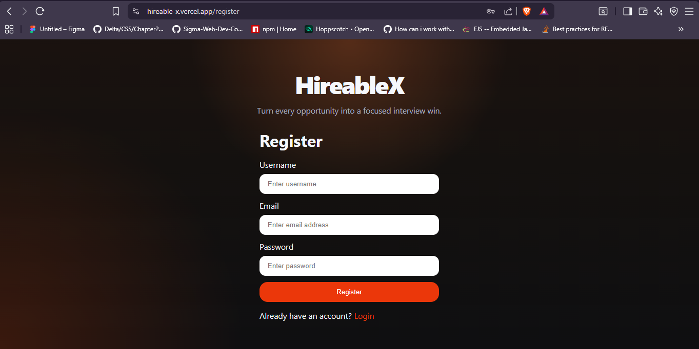

# HireableX 🚀

HireableX is an AI-powered interview preparation platform that helps users transform a target job description into a structured interview strategy and an ATS-friendly resume. It combines modern frontend engineering with backend AI orchestration to create a focused, practical, and recruiter-aligned workflow.

## 🌐 Live Demo

Frontend: https://hireable-x.vercel.app/ 

Backend: https://hireablex.onrender.com  


## 📸 Project Preview

<p align="center">
  
</p>

## What It Does ✨

- Generates a personalized interview report from:
  - target job description
  - uploaded resume
  - self-description
- Produces:
  - technical questions
  - behavioral questions
  - skill gap analysis
  - preparation roadmap
- Generates an ATS-friendly PDF resume using:
  - AI-generated HTML
  - Puppeteer-based PDF rendering
- Supports authentication, protected routes, report history, and downloadable outputs.

## Tech Stack 🛠️

- **Frontend:** React, Vite, React Router, Axios, Sass
- **Backend:** Node.js, Express.js, MongoDB, Mongoose
- **AI Layer:** Google Gemini API
- **File / PDF Processing:** Multer, pdf-parse, Puppeteer
- **Auth & Security:** JWT, cookie-based auth, blacklist-based logout flow

## Architecture 🧠

The project follows a layered feature-driven structure:

- **UI Layer:** React pages and styles
- **Hook Layer:** reusable feature hooks
- **State Layer:** React Context-based state management
- **API Layer:** Axios services + backend controllers/routes/services

This separation keeps the codebase modular, scalable, and easier to maintain.

## Core Workflows 📌

### 1. Interview Strategy Generation
- User submits job description + resume/self-description
- Backend extracts resume text
- Gemini generates structured JSON
- Platform renders a detailed interview dashboard

### 2. ATS Resume Generation
- AI creates a semantic HTML resume tailored to the target role
- Puppeteer converts the HTML into a downloadable PDF
- Active links like `mailto:`, `tel:`, LinkedIn, and portfolio URLs remain clickable

## Getting Started ⚙️

### Backend
```bash
cd Backend
npm install
npm run dev
```

### Frontend
```bash
cd Frontend
npm install
npm run dev
```

## Environment Variables 🔐

Create a `.env` file in the backend and configure values like:

```env
MONGODB_URI=your_mongodb_connection_string
JWT_SECRET=your_jwt_secret
GOOGLE_GENAI_API_KEY=your_gemini_api_key
```

## Why HireableX? 💡

HireableX is not just a resume or interview tool. It acts like a lightweight AI career-prep engine that blends **ATS optimization**, **LLM-driven content generation**, and **role-specific interview intelligence** into one streamlined developer-friendly platform.

